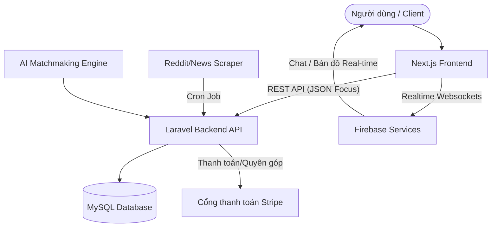
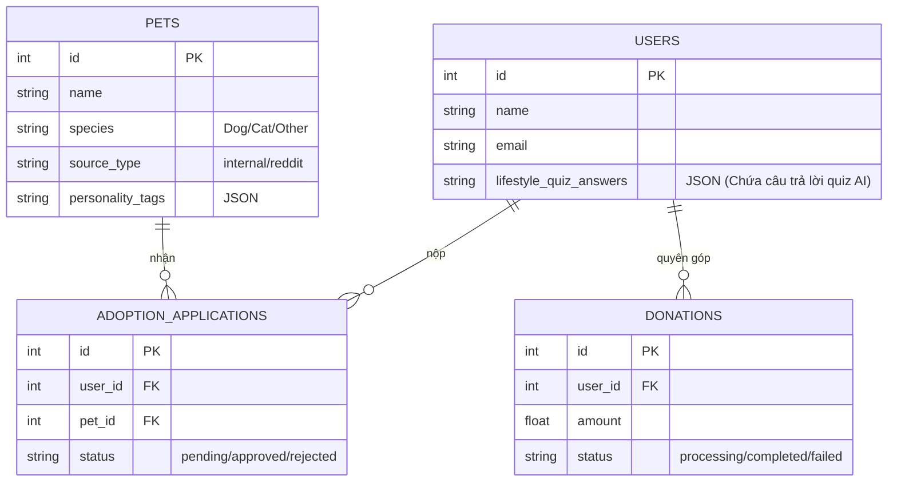

# Kế hoạch Tổng thể Xây dựng Website Pet Adoption 🐾

Dựa trên sự phối hợp của các kỹ năng trong hệ thống, dưới đây là bản kế hoạch end-to-end chi tiết:

---

## Bước 1: Tư duy chiến lược (Strategic Thinking)
*(Theo hướng dẫn từ `@brainstorming` & `@planning`)*

### Các tính năng đột phá
*   **AI Matchmaking:** Sử dụng thuật toán AI phân tích chi tiết hồ sơ người dùng (tuổi tác, thu nhập, giờ làm việc, kích thước nhà, và kinh nghiệm nuôi thú cưng) để ghép nối (match) với những bé thú cưng có nhu cầu không gian sống, tính cách tương đồng nhất (để tránh thú cưng bị trả lại sau khi nhận nuôi).
*   **Bản đồ cứu trợ Real-time (Rescue Map):** Tích hợp bản đồ trực tuyến cho phép cộng đồng báo cáo vị trí, tình trạng của động vật đi lạc. Trạm cứu hộ có thể theo dõi và điều phối tình nguyện viên gần đó nhất theo thời gian thực.

### Lộ trình triển khai (Roadmap)
1.  **Giai đoạn 1: MVP (Tháng 1-2):**
    *   Tính năng: Danh sách thú cưng đang cần tìm nhà, hồ sơ người nhận nuôi cơ bản, Form xin nhận nuôi (Adoption Application), Chức năng tìm kiếm và lọc cơ bản.
    *   Stack Kỹ thuật: Next.js (Frontend), Laravel API (Backend), MySQL DB.
2.  **Giai đoạn 2: Integration & Dữ liệu hóa (Tháng 3-4):**
    *   **Data Seeding:** Chạy Automations cào dữ liệu thú cưng từ Reddit và các bài đăng cứu hộ (với API đã xử lý).
    *   **Firebase / Realtime Chat:** Tích hợp tính năng Chat trực tiếp bằng Firebase giữa người xin nhận nuôi và tổ chức cứu hộ, nhận thông báo (Push Notifications).
    *   **AI Engine:** Bắt đầu triển khai service gợi ý (Matchmaking).
3.  **Giai đoạn 3: Scaling & Tối ưu lỗi (Tháng 5-6):**
    *   **Bản đồ cứu trợ Real-time:** Dùng WebSockets kết hợp Firebase Realtime Database.
    *   **Xử lý Thanh toán Quyên góp (Donations):** Tích hợp Stripe/PayPal với hệ thống Error Handling toàn diện theo thiết kế ở Bước 4.

---

## Bước 2: Thiết lập Bản sắc (Brand Identity)
*(Phân tích và thiết lập theo template UI/UX Case Study "PETJAM")*

*   **Tên dự án:** PETJAM (Website Nhận nuôi Thú cưng)
*   **Hệ quy chiếu Thiết kế (Màu sắc):**
    *   `Primary Color`: **#F07C3D** (Cam sáng) – Tạo sự nổi bật, thân thiện, kêu gọi hành động (CTA).
    *   `Secondary Color`: **#0489A9** (Xanh lam đậm / Teal) – Sự chuyên nghiệp, tin cậy đối phó với các tác vụ chức năng.
    *   `Dark / Text`: **#000000** (Đen tuyền) – Tương phản cao cho văn bản chính.
    *   `Background`: **#FFFFFF** / **#F8F9FA** – Đảm bảo phong cách sạch sẽ (Clean UI).
*   **Typography:**
    *   `Headings`: **Poppins** (Hiện đại, bo tròn, tạo cảm giác thân thiện và rõ ràng).
    *   `Body Text`: **Montserrat** (thanh lịch, dễ đọc, phù hợp hệ thống lưới grid thông tin màn hình nhỏ/lớn).
*   **Voice & Tone (Giọng điệu):** Thân thiện, nhanh gọn, chú trọng vào quá trình nhận nuôi "Simple, fast, and secure". Thông tin trình bày súc tích, dễ theo dõi. Giao diện trực quan hạn chế Form dài dòng.

---

## Bước 3: Thiết kế Dữ liệu & Tự động hóa (Data & Automation)
*(Theo hướng dẫn từ `@data-automation` & `@scraping-reddit`)*

### Kế hoạch Seeding Dữ liệu ban đầu
*   Sử dụng Python (`requests`, `PRAW`) tại thư mục `scripts/` hoặc Node.js để cào dữ liệu từ các subreddits: `r/rescuecats`, `r/rescuedogs`, `r/petadoption`.
*   Trích xuất: Tiêu đề, hình ảnh minh họa bài viết, nội dung tóm tắt câu chuyện cứu hộ. Format Json, làm phẳng structure (lọc bỏ phần thừa của API reddit).
*   Lưu trữ kết quả tạm thời ở thư mục `resources/reddit_seed_pets.json`.

### Luồng đổ dữ liệu tự động (Data Flow)
*   Thiết lập **Cron Job** (trên máy chủ hoặc Laravel Scheduler) chạy mỗi 12 tiếng.
*   **Pipeline:** Scraper (Python) ➜ Parser (Làm sạch data, format chuẩn hóa) ➜ Gửi Post Request tới Laravel API Endpoint (vd: `/api/internal/seeding/pets`) ➜ Lưu vào MySQL.
*   Cột `source_type` trong CSDL sẽ phân định giữa thú cưng nội bộ (từ admin thêm thủ công) và thú cưng tự động scrape (`reddit`), tránh nhầm lẫn khi người dùng nhận nuôi thật.

---

## Bước 4: Kiến trúc Kỹ thuật & Xử lý lỗi (Architecture & Error Handling)
*(Theo hướng dẫn từ `@error-handling-patterns`)*

### 4.1. Sơ đồ luồng (Flowchart)

### 4.2. Khái quát Cấu trúc Database (ER Diagram)

### 4.3. Danh sách API Endpoints (Laravel)

| HTTP Method | Endpoint | Use Case |
| :--- | :--- | :--- |
| `GET` | `/api/pets` | Lấy danh sách thú cưng (Pagination + Filters). |
| `POST` | `/api/pets/match` | Trả về gợi ý AI dựa trên object quiz đầu vào của người dùng. |
| `POST` | `/api/adoptions` | Nộp đơn nhận nuôi mới. Cần xử lý Transaction. |
| `GET` | `/api/adoptions/{id}` | Xem trạng thái đơn nhận nuôi của tải khoản. |
| `POST` | `/api/donations/charge` | Thanh toán quyên góp. Áp dụng Circuit Breaker. |
| `POST` | `/api/internal/seeding` | API dành riêng cho Crontab tự động bơm data đã cào về db. |

### 4.4. Xử lý lỗi (Exception Handling) chuẩn mực
Thực thi các Error Handling Pattern sau trên Backend (Laravel) cũng như Next.js Handling:

1.  **Custom Exception Hierarchy (Laravel):**
    *   Tự định nghĩa các lớp lỗi mở rộng từ `Exception` như: `AdoptionValidationException`, `PaymentProcessingException`, `ExternalServiceError`.
    *   Bắt tại Handler.php để thống nhất trả về JSON API Response chuẩn format, bao gồm HTTP Code (4xx, 5xx), mã lỗi nội bộ (Code) và Data chi tiết thông báo lỗi thân thiện với front-end.
2.  **Circuit Breaker & Exponential Backoff (Cổng thanh toán & AI):**
    *   Khi gọi API Stripe hoặc AI Engine, áp dụng Fallback. Nếu Stripe lỗi mạng/Timeout quá 3 lần -> Mở "Mạch" (Open Circuit) và thông báo cho người dùng sự cố Graceful Degradation: *"Cổng quyên góp tạm bảo trì, vui lòng quay lại sau"*.
3.  **Database Transactions (Toàn vẹn Dữ liệu):**
    *   Đơn **AdoptionApplication** và logic khóa trạng thái thú cưng (PetStatus = Pending) phải được gói gọn trong `DB::transaction()`. Nếu bất kỳ lỗi gì xuất hiện (cả lỗi kiểm tra logic), `DB::rollBack()` sẽ xả bỏ và ném `Exception` ra trình xử lý JSON thay vì lưu lại dữ liệu rác.
4.  **Aggegrate Error ở Frontend (Next.js):**
    *   Trong Form nhận nuôi, Next.js sẽ gom toàn bộ các lỗi validation logic (trống trường, sai format) hiển thị rõ ràng cho người dùng trước khi gọi API, giảm tải server.
